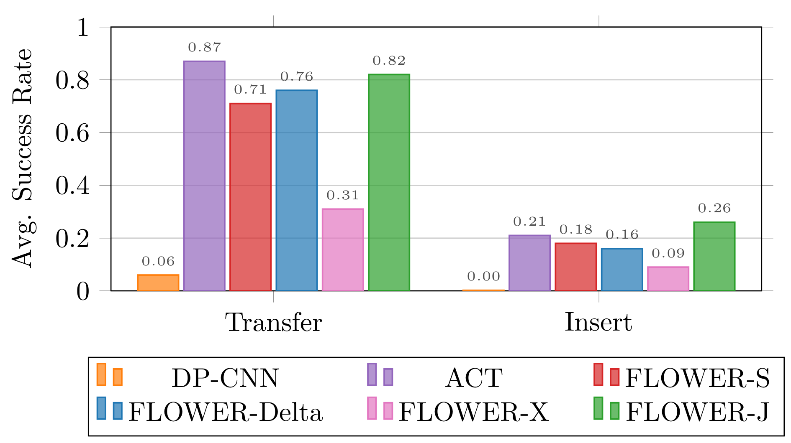

## Experiment Videos

### CALVIN

    

        

            

                <video width="100%" autoplay muted loop playsinline>
                    <source src="./static/video/fpl-vids/calvin/long_horizon_sequence_2_30000.mp4">
                </video>
            

            

                <video width="100%" autoplay muted loop playsinline>
                    <source src="./static/video/fpl-vids/calvin/long_horizon_sequence_1_30000.mp4">
                </video>
            

            

                <video width="100%" autoplay muted loop playsinline>
                    <source src="./static/video/fpl-vids/calvin/long_horizon_sequence_3_30000.mp4">
                </video>
            

            

                <video width="100%" autoplay muted loop playsinline>
                    <source src="./static/video/fpl-vids/calvin/long_horizon_sequence_0_30000.mp4">
                </video>
            

        

        

            

                <video width="100%" autoplay muted loop playsinline>
                    <source src="./static/video/fpl-vids/calvin/long_horizon_sequence_7_30000.mp4">
                </video>
            

            

                <video width="100%" autoplay muted loop playsinline>
                    <source src="./static/video/fpl-vids/calvin/long_horizon_sequence_5_30000.mp4">
                </video>
            

            

                <video width="100%" autoplay muted loop playsinline>
                    <source src="./static/video/fpl-vids/calvin/long_horizon_sequence_4_30000.mp4">
                </video>
            

            

                <video width="100%" autoplay muted loop playsinline>
                    <source src="./static/video/fpl-vids/calvin/long_horizon_sequence_6_30000.mp4">
                </video>
            

        

    

<!-- | Train→Test          | Method          | 1     | 2     | 3     | 4     | 5     | Avg. Len.       |
|---------------------|-----------------|-------|-------|-------|-------|-------|----------------|
| **ABC→D**           | Diff-P-CNN      | 63.5% | 35.3% | 19.4% | 10.7% | 6.4%  | 1.35±0.05      |
|                     | MDT             | 63.1% | 42.9% | 24.7% | 15.1% | 9.1%  | 1.55           |
|                     | RoboFlamingo    | 82.4% | 61.9% | 46.6% | 33.1% | 23.5% | 2.47           |
|                     | GR-1            | 85.4% | 71.2% | 59.6% | 49.7% | 40.1% | 3.06           |
|                     | 3DDA            | 93.8% | 80.3% | 66.2% | 53.3% | 41.2% | 3.35           |
|                     | VPP             | 95.7% | 91.2% | 86.3% | 81.0% | 75.0% | 4.29           |
|                     | Seer            | 96.3% | 91.6% | 86.1% | 80.3% | 74.0% | 4.28           |
|                     | **FLOWER (ours)** | **99.3%** | **96.0%** | **90.3%** | **82.3%** | **75.5%** | **4.44±0.04** |
| **ABCD→D**          | Diff-P-CNN      | 86.3% | 72.7% | 60.1% | 51.2% | 41.7% | 3.16±0.06      |
|                     | RoboFlamingo    | 96.4% | 89.6% | 82.4% | 74.0% | 66.0% | 4.09           |
|                     | GR-1            | 94.9% | 89.6% | 84.4% | 78.9% | 73.1% | 4.21           |
|                     | MDT             | 98.6% | 95.8% | 91.6% | 86.2% | 80.1% | 4.52±0.02      |
|                     | **FLOWER (ours)** | **98.9%** | **96.7%** | **93.9%** | **90.2%** | **85.5%** | **4.62±0.03** |

**Table:** *Experimental Results for the CALVIN ABCD and ABC settings.*  -->

### SIMPLER Benchmark

    

        

            

                <video width="100%" autoplay muted loop playsinline>
                    <source src="./static/video/fpl-vids/fpl_vids_simpler/Baked_sc1_staging_objaverse_cabinet2_h870/arm_pd_ee_delta_pose_align_interpolate_by_planner_gripper_pd_joint_target_delta_pos_interpolate_by_planner/GraspSingleOpenedCokeCanInScene-v0_upright_True/rob_0.35_0.2_rot_0.000_-0.000_3.142_rgb_overlay_None/success_obj_-0.1775_0.2_n_lift_significant_69_consec_grasp_True_grasped_True.mp4">
                </video>
            

            

                <video width="100%" autoplay muted loop playsinline>
                    <source src="./static/video/fpl-vids/fpl_vids_simpler/bridge_table_1_v1/arm_pd_ee_target_delta_pose_align2_gripper_pd_joint_pos/PutSpoonOnTableClothInScene-v0/rob_0.147_0.028_rot_0.000_-0.000_3.142_rgb_overlay_bridge_real_eval_1/success_obj_episode_17_moved_correct_obj_True_moved_wrong_obj_False_is_src_obj_grasped_True_consecutive_grasp_True_src_on_target_True.mp4">
                </video>
            

            

                <video width="100%" autoplay muted loop playsinline>
                    <source src="./static/video/fpl-vids/fpl_vids_simpler/modern_bedroom_no_roof/arm_pd_ee_delta_pose_align_interpolate_by_planner_gripper_pd_joint_target_delta_pos_interpolate_by_planner/CloseMiddleDrawerCustomInScene-v0_shader_dir_rt/rob_0.85_-0.2_rot_0.000_-0.000_3.142_rgb_overlay_None/success_obj_0.0_0.0_qpos_0.011.mp4">
                </video>
            

            

                <video width="100%" autoplay muted loop playsinline>
                    <source src="./static/video/fpl-vids/fpl_vids_simpler/frl_apartment_stage_simple/arm_pd_ee_delta_pose_align_interpolate_by_planner_gripper_pd_joint_target_delta_pos_interpolate_by_planner/CloseBottomDrawerCustomInScene-v0_shader_dir_rt_station_name_mk_station3/rob_0.65_0.2_rot_0.000_-0.000_3.142_rgb_overlay_None/success_obj_0.0_0.0_qpos_0.000.mp4">
                </video>
            

        

        

            

                <video width="100%" autoplay muted loop playsinline>
                    <source src="./static/video/fpl-vids/fpl_vids_simpler/bridge_table_1_v2/arm_pd_ee_target_delta_pose_align2_gripper_pd_joint_pos/PutEggplantInBasketScene-v0/rob_0.127_0.06_rot_0.000_-0.000_3.142_rgb_overlay_bridge_sink/success_obj_episode_6_moved_correct_obj_True_moved_wrong_obj_False_is_src_obj_grasped_True_consecutive_grasp_True_src_on_target_True.mp4">
                </video>
            

            

                <video width="100%" autoplay muted loop playsinline>
                    <source src="./static/video/fpl-vids/fpl_vids_simpler/bridge_table_1_v1/arm_pd_ee_target_delta_pose_align2_gripper_pd_joint_pos/PutCarrotOnPlateInScene-v0/rob_0.147_0.028_rot_0.000_-0.000_3.142_rgb_overlay_bridge_real_eval_1/success_obj_episode_6_moved_correct_obj_True_moved_wrong_obj_False_is_src_obj_grasped_True_consecutive_grasp_True_src_on_target_True.mp4">
                </video>
            

            

                <video width="100%" autoplay muted loop playsinline>
                    <source src="./static/video/fpl-vids/fpl_vids_simpler/google_pick_coke_can_1_v4_alt_background/arm_pd_ee_delta_pose_align_interpolate_by_planner_gripper_pd_joint_target_delta_pos_interpolate_by_planner/GraspSingleOpenedCokeCanInScene-v0_upright_True/rob_0.35_0.2_rot_0.000_-0.000_3.142_rgb_overlay_None/success_obj_-0.35_0.31_n_lift_significant_63_consec_grasp_True_grasped_True.mp4">
                </video>
            

            

                <video width="100%" autoplay muted loop playsinline>
                    <source src="./static/video/fpl-vids/fpl_vids_simpler/google_pick_coke_can_1_v4_alt_background/arm_pd_ee_delta_pose_align_interpolate_by_planner_gripper_pd_joint_target_delta_pos_interpolate_by_planner/MoveNearGoogleInScene-v0/rob_0.35_0.21_rot_0.000_-0.000_3.052_rgb_overlay_None/success_obj_episode_24_all_obj_keep_height_True_moved_correct_obj_True_moved_wrong_obj_False_near_tgt_obj_True_is_closest_to_tgt_True.mp4">
                </video>
            

        

    

<!-- | Method                       | Open/Close Drawer | Move Near        | Open Top Drawer and Place Apple | Pick Coke Can    | Average          |
|------------------------------|-------------------|------------------|---------------------------------|------------------|------------------|
| RT-1-X                       | **59.7**          | 31.7             | **21.3**                        | **56.7**         | **42.4**         |
| Octo                         | 22.7              | 4.2              | 0.0                             | 17.0             | 11.0             |
| CrossFormer                  | 0.5               | 4.6              | 0.0                             | 0.0              | 1.3              |
| OpenVLA                      | 35.6              | **46.2**         | 0.0                             | 16.3             | 24.5             |
| **FLOWER Cross-X Pret**      | 30.4              | 32.7             | 2.0                             | 35.8             | 25.2             |
| **FLOWER Delta EEF Pret**    | 31.7              | **46.3**         | 0.5                             | 50.2             | 32.2             |

**Table:** *Experimental Results for the SIMPLER Google Robot Benchmark.* 

| Method                      | Put Carrot on Plate | Spoon on Towel | Stack the Blocks | Eggplant in Yellow Basket | Average |
|-----------------------------|---------------------|----------------|------------------|---------------------------|---------|
| RT-1-X                      | 4                   | 0              | 0                | 0                         | 1.1     |
| Octo                        | 8                   | 12             | 0                | 43                        | 16      |
| CrossFormer                 | 15                  | 15             | 0                | 92                        | 30      |
| OpenVLA                     | 0                   | 0              | 0                | 4                         | 1.0     |
| **FLOWER Cross-X Pret**     | 13                  | **71**         | **8**            | 88                        | **45**  |
| **FLOWER Delta EEF Pret**   | **25**              | 33             | 0                | **100**                   | **40**  |

**Table:** *Experimental Results for the SIMPLER Bridge Benchmark.* -->

### LIBERO

    

        

            

                <video width="100%" autoplay muted loop playsinline>
                    <source src="./static/video/fpl-vids/libero/libero_10_22_onk9_p3_videos/video.mp4">
                </video>
            

            

                <video width="100%" autoplay muted loop playsinline>
                    <source src="./static/video/fpl-vids/libero/libero_10_22_onk9_p1_videos/video.mp4">
                </video>
            

            

                <video width="100%" autoplay muted loop playsinline>
                    <source src="./static/video/fpl-vids/libero/libero_10_22_onk9_p0_videos/video.mp4">
                </video>
            

            

                <video width="100%" autoplay muted loop playsinline>
                    <source src="./static/video/fpl-vids/libero/libero_10_22_onk9_p2_videos/video.mp4">
                </video>
            

        

        

            

                <video width="100%" autoplay muted loop playsinline>
                    <source src="./static/video/fpl-vids/libero/libero_10_22_onk9_p5_videos/video.mp4">
                </video>
            

            

                <video width="100%" autoplay muted loop playsinline>
                    <source src="./static/video/fpl-vids/libero/libero_10_22_onk9_p7_videos/video.mp4">
                </video>
            

            

                <video width="100%" autoplay muted loop playsinline>
                    <source src="./static/video/fpl-vids/libero/libero_10_22_onk9_p6_videos/video.mp4">
                </video>
            

            

                <video width="100%" autoplay muted loop playsinline>
                    <source src="./static/video/fpl-vids/libero/libero_10_22_onk9_p4_videos/video.mp4">
                </video>
            

        

    

<!-- | Method        | Spatial      | Object       | Goal         | Long         | 90           | Avg          |
|---------------|---------------------|---------------------|---------------------|---------------------|---------------------|---------------------|
| Diff-P-CNN    | 78.3 ± 1.1%         | 92.5 ± 0.7%         | 68.3 ± 1.2%         | 50.5 ± 1.3%         | -                   | 72.4 ± 0.7%         |
| Octo          | 78.9 ± 1.0%         | 85.7 ± 0.9%         | 84.6 ± 0.9%         | 51.1 ± 1.3%         | -                   | 75.1 ± 0.6%         |
| OpenVLA       | 88.4 ± 0.8%         | 88.4 ± 0.8%         | 79.2 ± 1.0%         | 53.7 ± 1.3%         | -                   | 76.5 ± 0.6%         |
| Baku          | -                   | -                   | -                   | 86.0                | 90.0                | -                   |
| **FLOWER**    | **97.1 ± 2.1%**     | **96.7 ± 0.4%**     | **95.6 ± 0.6%**     | **93.5 ± 2.0%**     | **93.2 ± 1.2%**     | **95.7 ± 0.7%**     |

**Table:** *Experimental Results for the LIBERO benchmark. Average without LIBERO-90.* -->

### Bi-Manual Aloha

    

        

            

                <video width="100%" autoplay muted loop playsinline>
                    <source src="./static/video/aloha-sim/transfer_5.mp4">
                </video>
                
Transfer

            

            

                <video width="100%" autoplay muted loop playsinline>
                    <source src="./static/video/aloha-sim/insertion_5.mp4">
                </video>
                
Insertion

            

        

    

<!-- 

    

**Figure:** *Experimental Results for the Aloha Simulation Tasks.* -->

### Real-World Generalization

    

        

            

                <video width="100%" autoplay muted loop playsinline>
                    <source src="./static/video/real_bg_distractor/flower/banana_from_right_stove_to_sink/primary_camera.mp4">
                </video>
                
Move the banana from right stove to sink. (FLOWER w/ bg distractors)

            

            

                <video width="100%" autoplay muted loop playsinline>
                    <source src="./static/video/real_bg_distractor/openvla/banana_from_right_stove_to_sink/primary_camera.mp4">
                </video>
                
Move the banana from right stove to sink. (OpenVLA w/ bg distractors)

            

            

                <video width="100%" autoplay muted loop playsinline>
                    <source src="./static/video/real_bg_distractor/flower/open_oven/primary_camera.mp4">
                </video>
                
Open the oven door. (FLOWER w/ bg distractors)

            

            

                <video width="100%" autoplay muted loop playsinline>
                    <source src="./static/video/real_bg_distractor/openvla/open_oven/primary_camera.mp4">
                </video>
                
Open the oven door. (OpenVLA w/ bg distractors)

            

        

        

            

                <video width="100%" autoplay muted loop playsinline>
                    <source src="./static/video/real_flashlight/flower/banana_from_right_stove_to_sink/primary_camera.mp4">
                </video>
                
Move the banana from right stove to sink. (FLOWER w/ flashlight)

            

            

                <video width="100%" autoplay muted loop playsinline>
                    <source src="./static/video/real_flashlight/openvla/banana_from_right_stove_to_sink/primary_camera.mp4">
                </video>
                
Move the banana from right stove to sink. (OpenVLA w/ flashlight)

            

            

                <video width="100%" autoplay muted loop playsinline>
                    <source src="./static/video/real_flashlight/flower/pot_from_right_stove_to_sink/primary_camera.mp4">
                </video>
                
Move the pot from the right stove to sink. (FLOWER w/ flashlight)

            

            

                <video width="100%" autoplay muted loop playsinline>
                    <source src="./static/video/real_flashlight/openvla/pot_from_right_stove_to_sink/primary_camera.mp4">
                </video>
                
Move the pot from the right stove to sink. (OpenVLA w/ flashlight)

            

        

        

            

                <video width="100%" autoplay muted loop playsinline>
                    <source src="./static/video/real_novel/novel_flower/Move the glove from right stove to sink/primary_camera.mp4">
                </video>
                
Move the glove from right stove to sink. (FLOWER w/ novel objects)

            

            

                <video width="100%" autoplay muted loop playsinline>
                    <source src="./static/video/real_novel/novel_openvla/Move the glove from right stove to sink/primary_camera.mp4">
                </video>
                
Move the glove from right stove to sink. (OpenVLA w/ novel objects)

            

            

                <video width="100%" autoplay muted loop playsinline>
                    <source src="./static/video/real_novel/novel_flower/Move the red cup from right stove to sink/primary_camera.mp4">
                </video>
                
Move the red cup from right stove to sink. (FLOWER w/ novel objects)

            

            

                <video width="100%" autoplay muted loop playsinline>
                    <source src="./static/video/real_novel/novel_openvla/Move the red cup from right stove to sink/primary_camera.mp4">
                </video>
                
Move the red cup from right stove to sink. (OpenVLA w/ novel objects)

            

        

    

### Real-World Single-Task and Multi-Task Long Horizon Experiments

Representative evaluation videos of FLOWER on all 20 real-world tasks and 3 multi-task long horizon sequences.

#### Single Task

    

        

            

                <video width="100%" autoplay muted loop playsinline>
                    <source src="./static/video/real_vids/banana_from_right_stove_to_oven_tray/primary_camera.mp4">
                </video>
                
Move banana from right stove to oven tray

            

            

                <video width="100%" autoplay muted loop playsinline>
                    <source src="./static/video/real_vids/banana_from_right_stove_to_sink/primary_camera.mp4">
                </video>
                
Move banana from right stove to sink

            

            

                <video width="100%" autoplay muted loop playsinline>
                    <source src="./static/video/real_vids/banana_from_sink_to_right_stove/primary_camera.mp4">
                </video>
                
Move banana from sink to right stove

            

            

                <video width="100%" autoplay muted loop playsinline>
                    <source src="./static/video/real_vids/banana_from_tray_to_right_stove/primary_camera.mp4">
                </video>
                
Move banana from tray to right stove (FAILURE)

            

        

        

            

                <video width="100%" autoplay muted loop playsinline>
                    <source src="./static/video/real_vids/close_ice/primary_camera.mp4">
                </video>
                
Close the ice box

            

            

                <video width="100%" autoplay muted loop playsinline>
                    <source src="./static/video/real_vids/close_microwave/primary_camera.mp4">
                </video>
                
Close the microwave

            

            

                <video width="100%" autoplay muted loop playsinline>
                    <source src="./static/video/real_vids/close_oven/primary_camera.mp4">
                </video>
                
Close the oven

            

            

                <video width="100%" autoplay muted loop playsinline>
                    <source src="./static/video/real_vids/open_ice/primary_camera.mp4">
                </video>
                
Open the ice box

            

        

        

            

                <video width="100%" autoplay muted loop playsinline>
                    <source src="./static/video/real_vids/open_microwave/primary_camera.mp4">
                </video>
                
Open the microwave

            

            

                <video width="100%" autoplay muted loop playsinline>
                    <source src="./static/video/real_vids/open_oven/primary_camera.mp4">
                </video>
                
Open the oven

            

            

                <video width="100%" autoplay muted loop playsinline>
                    <source src="./static/video/real_vids/pickup_toast_and_put_to_sink/primary_camera.mp4">
                </video>
                
Pick up toast and put it in the sink

            

            

                <video width="100%" autoplay muted loop playsinline>
                    <source src="./static/video/real_vids/pot_from_left_stove_to_sink/primary_camera.mp4">
                </video>
                
Move pot from left stove to sink

            

        

        

            

                <video width="100%" autoplay muted loop playsinline>
                    <source src="./static/video/real_vids/pot_from_left_to_right_stove/primary_camera.mp4">
                </video>
                
Move pot from left to right stove

            

            

                <video width="100%" autoplay muted loop playsinline>
                    <source src="./static/video/real_vids/pot_from_right_stove_to_sink/primary_camera.mp4">
                </video>
                
Move pot from right stove to sink

            

            

                <video width="100%" autoplay muted loop playsinline>
                    <source src="./static/video/real_vids/pot_from_right_to_left_stove/primary_camera.mp4">
                </video>
                
Move pot from right to left stove

            

            

                <video width="100%" autoplay muted loop playsinline>
                    <source src="./static/video/real_vids/pot_from_sink_to_left_stove/primary_camera.mp4">
                </video>
                
Move pot from sink to left stove (FAILURE)

            

        

        

            

                <video width="100%" autoplay muted loop playsinline>
                    <source src="./static/video/real_vids/pot_from_sink_to_right_stove/primary_camera.mp4">
                </video>
                
Move pot from sink to right stove

            

            

                <video width="100%" autoplay muted loop playsinline>
                    <source src="./static/video/real_vids/pull_oven_tray/primary_camera.mp4">
                </video>
                
Pull the oven tray

            

            

                <video width="100%" autoplay muted loop playsinline>
                    <source src="./static/video/real_vids/push_oven_tray/primary_camera.mp4">
                </video>
                
Push the oven tray

            

            

                <video width="100%" autoplay muted loop playsinline>
                    <source src="./static/video/real_vids/push_toaster_lever/primary_camera.mp4">
                </video>
                
Push down the toaster lever (FAILURE)

            

        

    

#### Multi-Task Long Horizon

See the appendix in the paper for a listing of individual tasks in each sequence.

    

        

            

                <video width="100%" autoplay muted loop playsinline>
                    <source src="./static/video/real_vids/sequence_open_close_all_100.mp4">
                </video>
                
Open/Close All sequence, video shows 6/6 evaluation.

            

            

                <video width="100%" autoplay muted loop playsinline>
                    <source src="./static/video/real_vids/sequence_oven_200.mp4">
                </video>
                
Oven sequence, video shows 0/5 evaluation.

            

            

                <video width="100%" autoplay muted loop playsinline>
                    <source src="./static/video/real_vids/sequence_stovetop_sink_152.mp4">
                </video>
                
Stovetop Sink sequence, video show 3/5 evaluation.

            

        

    

